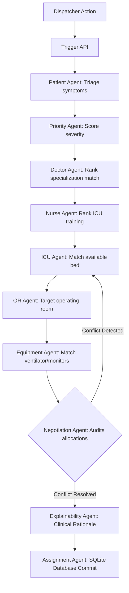

# MEDSYNC AI - PS 010
### Smart Hospital Resource Synchronization & Emergency Command Center
**React · FastAPI · SQLite · Leaflet · LangGraph · License: MIT**

One workspace for dispatchers, hospital resource tracking, LangGraph multi-agent routing, and real-time fleet coordination.

[Access Dashboard](https://lets-quite-tariff-motel.trycloudflare.com) · [View Features](#features) · [API Docs](https://lets-quite-tariff-motel.trycloudflare.com/docs) · [Architecture](#-langgraph-agentic-orchestration)

---

## Features
| Feature | Description |
|---|---|
| 🔐 Session Routing & Auth | Client-side routing with `AuthProvider` and mock sign-in bypass for instant trial setup |
| 🔄 LangGraph Orchestration | Multi-agent state graph pipeline automatically coordinates triaging, severity scoring, resource candidate ranking, and conflict negotiation |
| 🚑 Fleet Live Tracking | Real-time map rendering of ambulance positions using Leaflet, featuring status-colored markers and dynamic map panning |
| 🏥 Resource Manager | Monitor and update live occupancy status of ICU beds, Operating Rooms, and equipment (ventilators, vitals monitors) |
| 👥 Medical Directory | Central registry of doctors and nurses, tracking shifts, qualifications, specializations, and real-time availability |
| 📝 Patient Admissions | Detailed patient registries recording intake demographics, medical history, blood group, current condition, and ward assignments |
| 📊 Analytics Dashboard | Resource utilization charts, active capacity meters, and regional hospital network mapping |
| 🌐 Tunnel Deployment | Single-URL reverse proxy setup via Cloudflare Tunnel (`cloudflared`) to expose local servers over secure public HTTPS |

---

## Application Screenshots
### Enterprise Dashboard
The centralized hub displays live resource capacity statistics, doctor/patient counts, resource utilization charts, and a regional interactive hospital map.


### Emergency Command Center
Dispatcher's central console. Select an incoming emergency patient, trigger the LangGraph orchestration engine, and view node-by-node agent execution logs and resource assignments in real-time.


---

## Tech Stack
### Frontend
| Technology | Version | Purpose |
|---|---|---|
| **React** | 19 | UI component library |
| **Vite** | 8 | Next-generation frontend build tooling |
| **TypeScript** | 6 | Type-safe JavaScript |
| **Tailwind CSS** | 3 | Utility-first styling |
| **React Router DOM**| 7 | Client-side routing and layout guards |
| **React Leaflet** | 5 | Interactive mapping library |
| **TanStack Query** | 5 | Async API state management |
| **Lucide React** | — | SVG Icon library |

### Backend
| Technology | Purpose |
|---|---|
| **FastAPI** | High-performance async API framework |
| **SQLAlchemy** | ORM and database schema toolkit |
| **SQLite** | Local file-based development database |
| **LangGraph** | Multi-agent state graph orchestration framework |
| **Pydantic** | Schema validation and serialization |
| **Bcrypt (Passlib)** | Local password hashing |

### Infrastructure
| Service | Purpose |
|---|---|
| **Cloudflare Tunnel** | Secure HTTPS tunnel exposing the localhost dev server |
| **Uvicorn** | ASGI web server |

---

## Project Structure
```
medsync-ai/
├── frontend/                   # React 19 + Vite application
│   ├── src/
│   │   ├── api/               # API clients and proxy interceptors
│   │   │   └── apiClient.ts   # Axios client with trailing slash normalizer
│   │   ├── components/        # Shared UI components
│   │   ├── context/           # React context providers
│   │   │   └── AuthContext.tsx # Global token and login state provider
│   │   ├── layouts/           # Page layouts
│   │   │   └── DashboardLayout.tsx # Route guard and sidebar layout
│   │   ├── pages/             # Route pages
│   │   │   ├── Ambulances.tsx # Live Leaflet fleet tracking map & list
│   │   │   ├── Dashboard.tsx  # Analytics charts and hospital map
│   │   │   ├── EmergencyCommand.tsx # LangGraph node execution console
│   │   │   └── Login.tsx      # Sign-In form with prefilled credentials
│   │   ├── App.tsx            # Main routes definition
│   │   └── main.tsx           # Entry point
│   ├── vite.config.ts         # Vite server proxy and allowedHosts setup
│   └── package.json           # Dependencies and scripts
│
├── backend/                   # FastAPI Python application
│   ├── app/
│   │   ├── api/               # Router endpoints and dependencies
│   │   │   ├── deps.py        # Authentication dependency hooks
│   │   │   ├── auth.py        # Token auth endpoints
│   │   │   ├── dashboard.py   # Dashboard aggregation stats
│   │   │   └── hospital_resources.py # CRUD resource endpoints
│   │   ├── core/              # Settings and security configs
│   │   ├── db/                # Session configurations and seeds
│   │   ├── models/            # SQLAlchemy domain models
│   │   ├── schemas/           # Pydantic validation schemas
│   │   └── workflow/          # LangGraph resource orchestration
│   │       └── graph.py       # Multi-agent state graph definitions
│   ├── main.py                # FastAPI entry point
│   ├── run.bat                # Full-stack start script
│   └── requirements.txt       # Python dependencies
└── README.md                  # This file
```

---

## Installation & Deployment
You can run the entire stack locally for development or expose it securely.

### Option A: Local Dev Setup
1. **Start Backend**:
   ```bash
   cd backend
   python -m venv venv
   .\venv\Scripts\activate
   pip install -r requirements.txt
   uvicorn main:app --reload
   ```
2. **Start Frontend**:
   ```bash
   cd frontend
   npm install
   npm run dev
   ```
3. Open `http://localhost:5173` in your browser.

### Option B: Cloudflare Tunnel Expose (Single Link)
We use Vite's built-in reverse proxy to route frontend and backend calls through a single public domain:
1. Ensure the backend runs on `localhost:8000`.
2. Start the Vite dev server on `localhost:5173`.
3. In a separate terminal, expose the Vite server using `cloudflared`:
   ```bash
   C:\path\to\cloudflared.exe tunnel --url http://localhost:5173
   ```
4. Access the public link printed in the Cloudflare console.

---

## API Reference
All endpoints are prefixed with `/api/v1`.

### Core API Endpoints
| Method | Endpoint | Description |
|---|---|---|
| **GET** | `/dashboard/stats` | Retrieve dashboard KPI counts and occupancy statistics |
| **GET** | `/hospitals/map` | Retrieve geo-coordinates for the hospital network map |
| **GET** | `/hospital-admin/doctors` | Retrieve medical doctors directory |
| **GET** | `/hospital-admin/patients` | Retrieve admitted and emergency patient logs |
| **GET** | `/hospital-admin/icu-beds` | Retrieve ICU bed status list |
| **GET** | `/hospital-admin/operating-rooms` | Retrieve Operating Room status list |
| **GET** | `/hospital-admin/ambulances` | Retrieve active ambulance fleet logs |
| **POST** | `/workflow/process` | Dispatch the LangGraph engine for patient resource matching |

---

## 🔄 LangGraph Agentic Orchestration
MedSync AI features a multi-agent orchestration pipeline that executes resource matches node-by-node.



1. **Patient Agent**: Analyzes triage symptoms and history to list necessary resource types.
2. **Priority Agent**: Assesses vitals to calculate a deterministic severity level (Critical, High, Medium, Low).
3. **Doctor & Nurse Agents**: Queries active personnel and ranks them based on experience and schedules.
4. **ICU & OR Agents**: Filters and locks available ICU beds and surgical theaters.
5. **Equipment Agent**: Provisions physical machinery (e.g., ventilators, ECGs) to match symptoms.
6. **Negotiation Agent**: Resolves conflicts. *Example:* If the top ICU bed is blocked, it rejects the match and loops back to allocate the next best candidate.
7. **Explainability Agent**: Compiles clinical rationale explaining the allocations.
8. **Assignment Agent**: Updates the SQLite database, locks resources, and terminates the graph.

---

## Demo Flow
1. User logs in with `admin@medsync.com` / `admin123`.
2. Accesses the **Enterprise Dashboard** to view live utilization statistics.
3. Navigates to the **Emergency Command Center**.
4. Clicks **Process** on a patient (e.g. *Diana Prince* with severe bleeding).
5. Observes the LangGraph execute node-by-node, resolving a simulated ICU maintenance conflict.
6. Reviews the clinical explainability summary and sees updated resource states.
7. Navigates to **Fleet Management** to track ambulance positions.

---

## Roadmap
- [ ] Real-time WebSocket notifications for ambulance positions
- [ ] Semantic search on patient case history using pgvector
- [ ] Multi-hospital resource sharing algorithms
- [ ] Integration with Twilio for automated dispatch alerts

---

## License
Distributed under the MIT License.
